# OCPQ Evaluation Data

This repository holds evaluation data for the OCPQ tool.
Also see https://ocpq.aarkue.eu/ and https://github.com/aarkue/OCPQ.

The software version of OCPQ used is equivalent with the release v0.6.7, available at https://github.com/aarkue/OCPQ/releases/tag/v0.6.7.
We tested our implementation by running the backend web server in release mode.

The evaluation was performed on an OCEL 2.0 file based on the BPI Challenge 2017 (see https://data.4tu.nl/datasets/34c3f44b-3101-4ea9-8281-e38905c68b8d/1 and https://data.4tu.nl/datasets/5c9717a0-4c22-4b78-a3ad-d2234208bfd7/1 as well as https://data.4tu.nl/datasets/6889ca3f-97cf-459a-b630-3b0b0d8664b5/1).

The used files (OCEL 2.0 in JSON and SQLite format) are available for download as `./bpic2017-ocel2.zip` (OCEL 2.0 JSON), `./bpic2017.sqlite.zip`, and `./bpic2017.duckdb.zip` in this repository.
The Neo4J dump, is available [here](https://data.4tu.nl/datasets/5c9717a0-4c22-4b78-a3ad-d2234208bfd7/1).

## Results
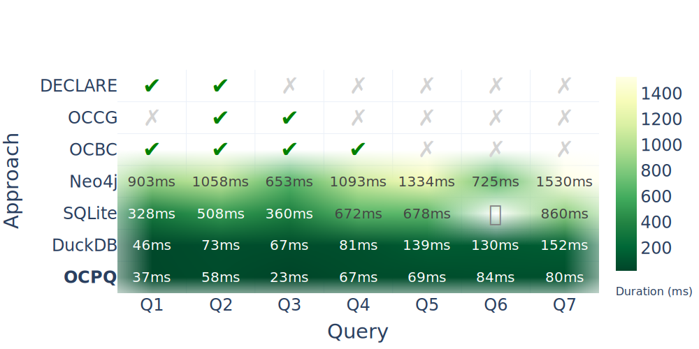

Note, that a previous version of this repository used a different evaluation approach, and the SQLite durations where measured individually. In the current version, `sqlite3` from Python is used.
Moreover, the SQL queries were different, and updated ones (also compatible with DuckDB) were used for the newest evaluation results.

Below, the query/constraint formulations in the graphical approaches are included.
For SQL (SQLite) and Cypher (Neo4J), see the `sql.txt` and `neo4j-cypher.txt` files available in each subdirectory (Q1 - Q7).
The exported versions of the queries/constraints in OCPQ are also available (e.g., as `Q1.json` for usage in frontend, simply copy the text content and paste using alt+v in the OCPQ tool).
We also included all raw measurements as .json files, containing the measured durations in seconds.

## Q1
### DECLARE
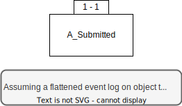

### OCBC
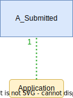

### **_OCPQ_**
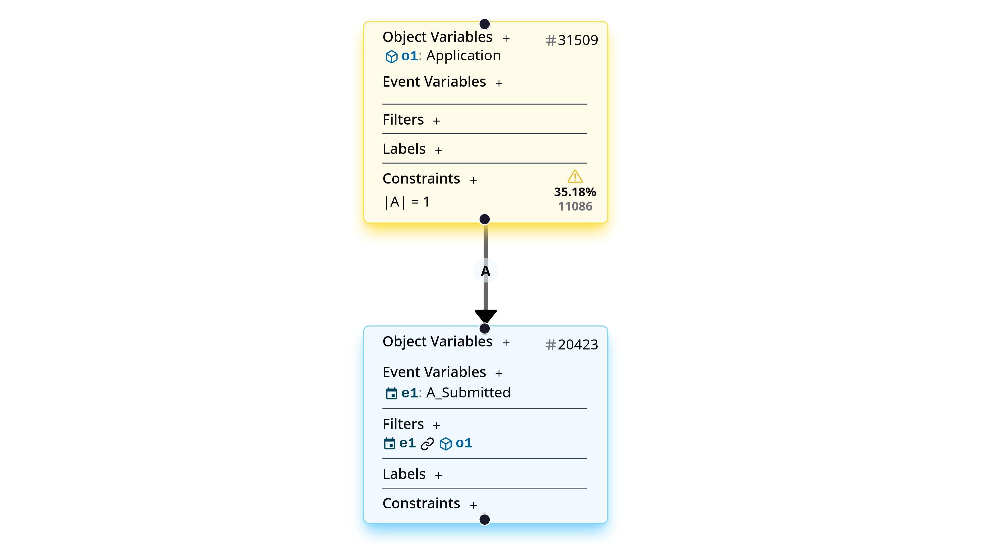

## Q2
### DECLARE
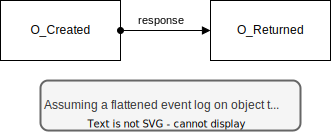

### OCCG
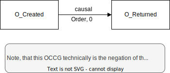

### OCBC

### **_OCPQ_**
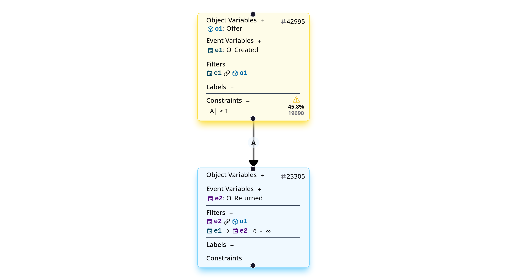

## Q3

### OCCG

### OCBC
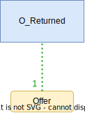
### **_OCPQ_**
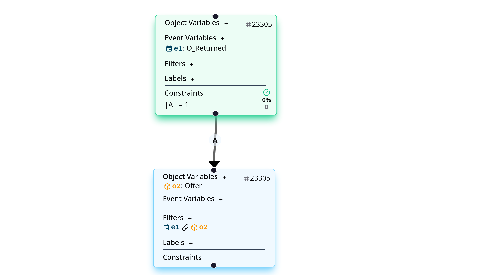

## Q4

### OCBC

### **_OCPQ_**
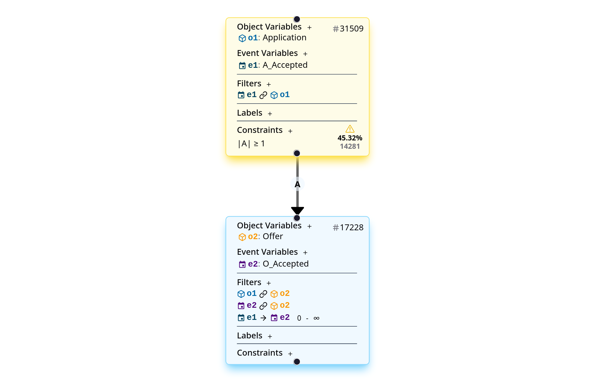

## Q5
### **_OCPQ_**
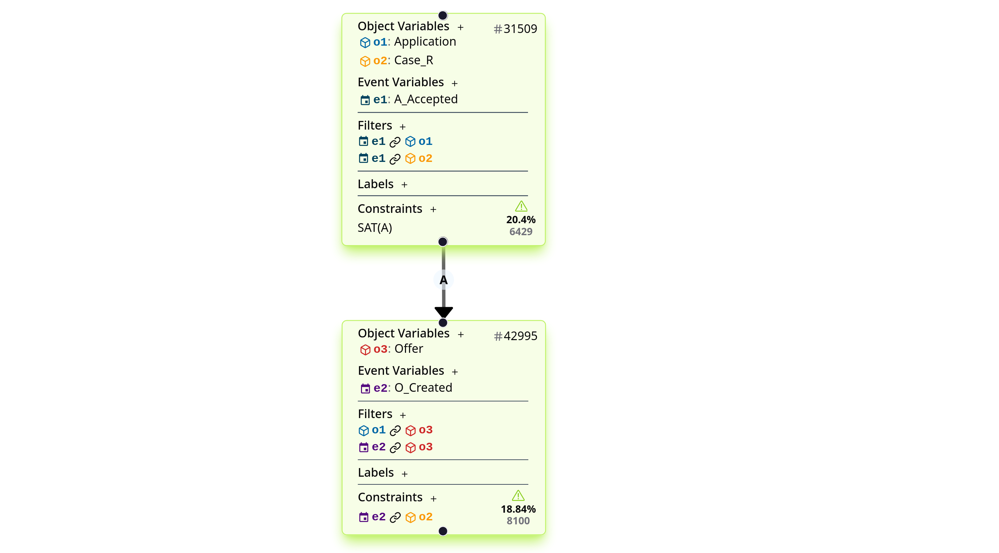

## Q6
### **_OCPQ_**
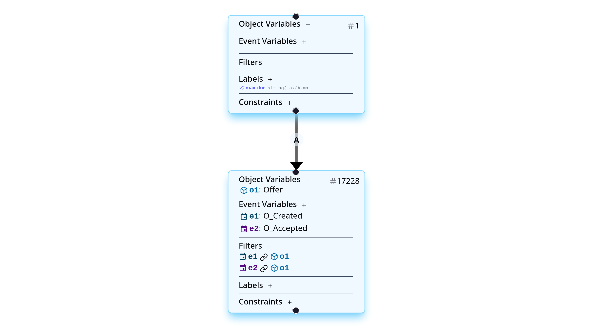

## Q7
### **_OCPQ_**
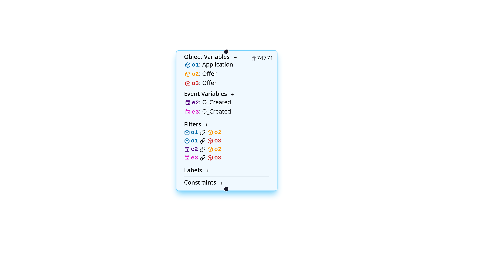
